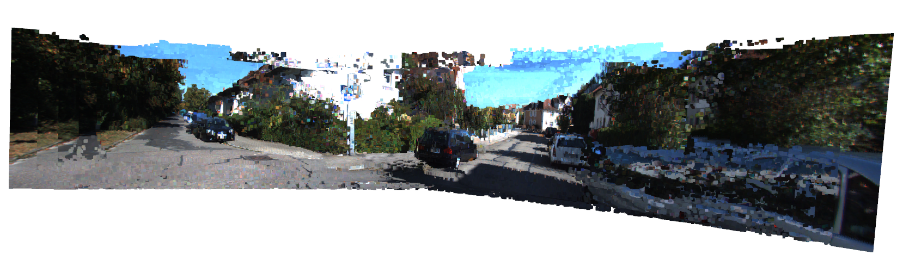
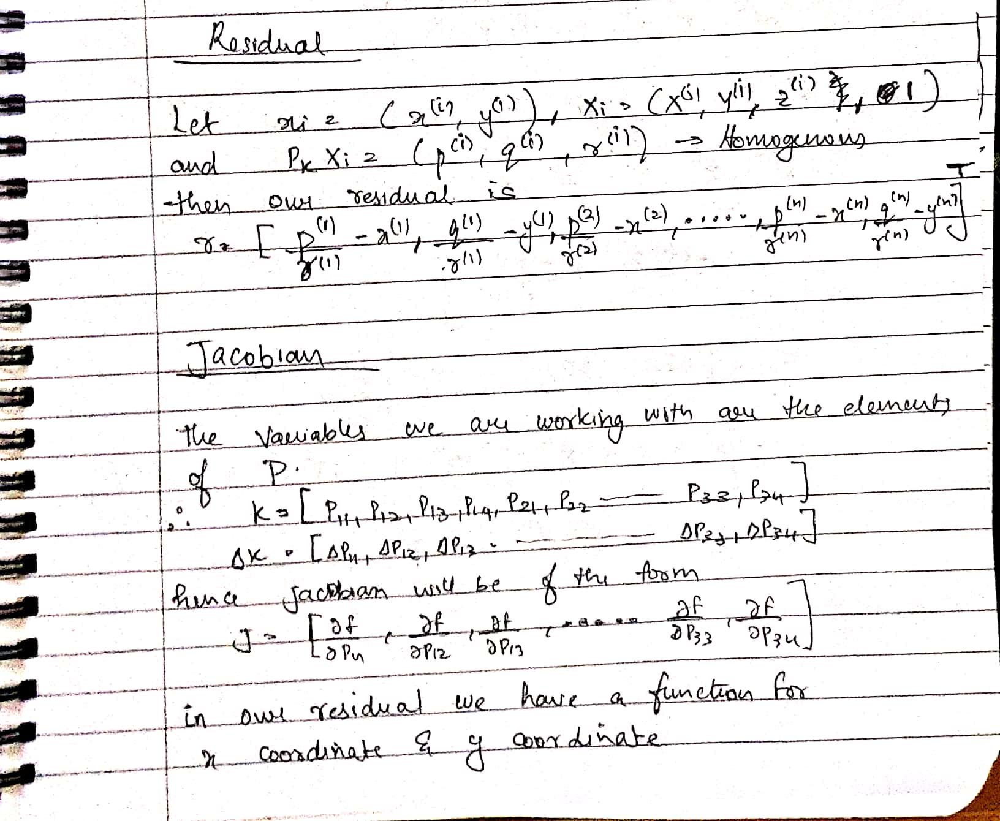
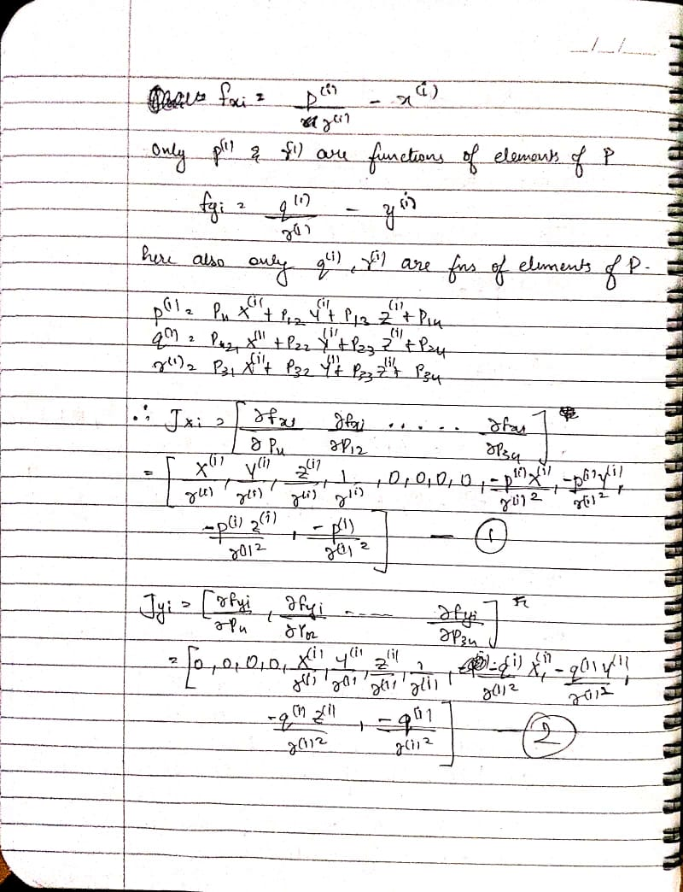
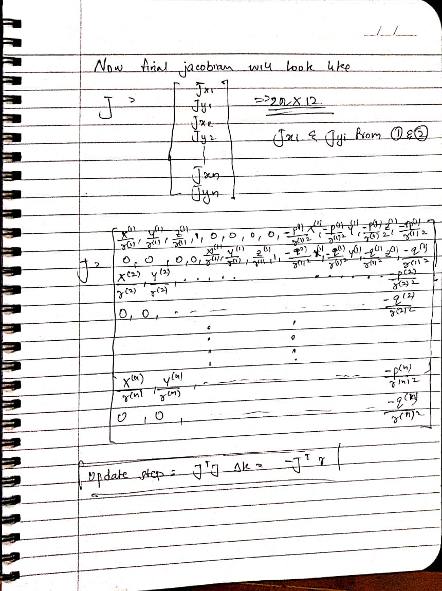
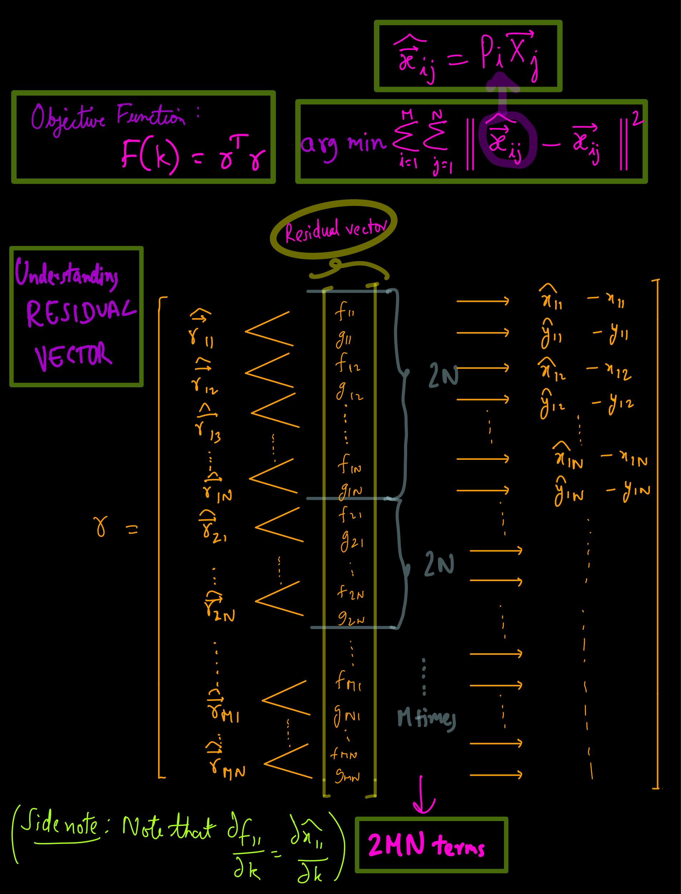
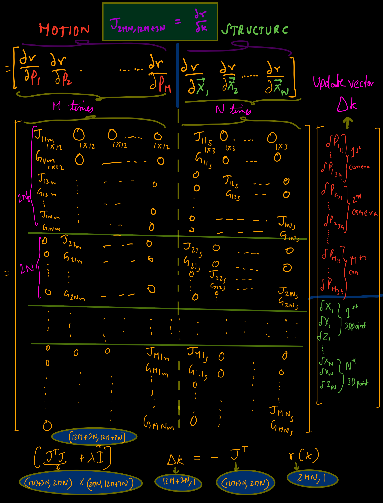

# Stereo Reconstruction, PnP, ICP and Bundle Adjustment

## Stereo SLAM
This question has been designed to test your understanding of the concepts that create a SLAM system, from creating a front-end using Stereo Matching to a backend where you optimise to get your odometry to stitch the pointclouds obtained from the front end to build a map of the environment.

The dataset has been provided in `data/`. `img2` and `img3` correspond to the left and right camera respectively. `poses.txt` has the pose information for all frames. `calib.txt` has camera calibration information.

### Part - 1: Stereo Dense Reconstruction
3-D point clouds are very useful in robotics for several tasks such as object detection, motion estimation (3D-3D matching or 3D-2D matching), SLAM, and other forms of scene understanding.  Stereo camerasprovide  us  with  a  convenient  way  to  generate  dense  point  clouds.Densehere,  in  contrast  tosparse,means all the image points are used for the reconstruction.  In this part of the assignment you will begenerating a dense 3D point cloud reconstruction of a scene from stereo images.

#### Procedure: 

<ol>
    <li> Generate a disparity map for each stereo pair.  Use OpenCV (e.g.  StereoSGBM) for this.  Notethat the images provided are already rectified and undistorted. </li>
    <li> Then, using the camera parameters and baseline information generate colored point clouds from each disparity map.  Some points will have invalid disparity values, so ignore them.  Use [Open3D]for storing your point clouds. </li>
    <li> Register (or transform) all the generated point clouds into your world frame by using the providedground truth poses. </li>
    <li> Visualize the registered point cloud data, in color.  Use Open3D for this </li>
</ol>

##### Reconstructed Image:

##### Disparity Map Generation
Each stereo image pair creates a disparity map. This is done by looking at the difference between the right and left image of the stereo camera. The disparity map is the difference in position of the object observed in the two images and is inversely proportional to the depth of the object. 

The function used to create the disparity map is the StereoSGBM function. It uses Semi-Global Block matching to find corresponding matches and uses that to find the disparity map. It uses Birchfield-Tomasi sub-pixel metric as the cost function and matches blocks instead of individual pixels. Using default parameters, the final output wasn't human readable. 

### Part - 2: Motion estimation using iterative PnP

Using the generated reconstruction from the previous part, synthesize a new image taken by a virtualmonocular camera fixed at any arbitrary position and orientation.  Your task in this part is to recoverthis pose using an iterative Perspective-from-n-Points (PnP) algorithm. 

#### Procedure: 

1. Obtain a set of 2D-3D correspondences between the the image and the point cloud.  Since hereyou’re generating the image, this should be easy to obtain.
2. For this set of correspondences compute the total reprojection error c= $\sum_{i} ‖x_i−P_{k}X_i‖^2 $    where $P_{k}= K[R_{k}|t_{k}]$, $X_{i}$ is the 3D point in the world frame, $x_{i}$ is its corresponding projection.
3. Solve for the pose $T_{k}$ that minimizes this non-linear reprojection error using a Gauss-Newton (GN)scheme.  Recall that in GN we start with some initial estimated value $x_{o}$ and iteratively refine the estimate using $x_{1}$= $∆x+x_0$, where $∆x$ is obtained by solving the normal equations $J^{T}J∆x$= -$J^{T}e$, until convergence.The main steps in this scheme are computing the corresponding Jacobians and updating the estimates correctly.  For our problem,  use a 12×1 vector parameterization for $T_{k}$(the top 3×4submatrix).  Run the optimization for different choices of initialization and report your observations.

#### Observation: 
As we can see, the calculated P matrix (using Gauss Newton) comes close to the original P matrix. We also notice that for certain initialisations it does not converge. This may be due to the learning rate being equal to 1 or because it gets stuck in a local minima.

#### Jacobian:

### Part - 3: Odometry Calculation
<b>Goal</b>: Estimate the pose using the RGB image data alone

#### Procedure:

1. This can be done by computing features across the two images and matching them. Since you already have the depth map, you now have correspondences between the depth maps of two images as well from the RGB feature matches. 
2. You can now convert this depth map to a point cloud.
3. Since you have correspondences between image points in the depth map, you have 3D correspondences here as well. Perform ICP here to get a good pose estimate.
4. Feed these initial pose estimates into the PnP pipeline and optimise further.

#### A short review on Structure from Motion
##### Residual

You can see that computing Jacobian of `fun` is cumbersome, thus we will rely on the finite difference approximation. To make this process time feasible we provide Jacobian sparsity structure (i. e. mark elements which are known to be non-zero):

